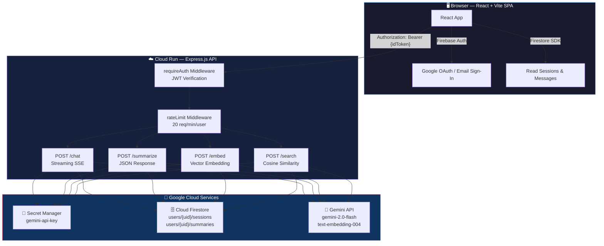

<div align="center">
  

  <br/><br/>

  <h1>📓 Gemini Journal</h1>
  <h3><em>Your intelligent, private space to think, reflect, and grow — powered by Google Gemini.</em></h3>

  <br/>

  <p>
    <a href="https://reactjs.org/"></a>
    <a href="https://vitejs.dev/"></a>
    <a href="https://www.typescriptlang.org/"></a>
    <a href="https://firebase.google.com/"></a>
    <a href="https://deepmind.google/technologies/gemini/"></a>
    <a href="https://cloud.google.com/run"></a>
  </p>

  <p>
    
    
    
    
    
  </p>

  <br/>

  <p><strong>Built for the Google Gemini Hackathon on Hack2Skill</strong></p>

  <br/>
</div>

---

<br/>

## 🌟 What is Gemini Journal?

**Gemini Journal** transforms personal journaling from a simple diary into an **AI-powered self-reflection engine**. Write freely, and Google Gemini acts as a thoughtful companion — asking follow-up questions, tracking your emotional journey over time, surfacing recurring themes, and letting you semantically search your past reflections by *meaning*, not just keywords.

The entire stack is built with a **security-first** mindset: deny-by-default Firestore rules, JWT verification on every API call, secrets from GCP Secret Manager, and per-user data isolation that makes cross-user leaks architecturally impossible.

<br/>

---

<br/>

## ✨ Features

<table>
  <tr>
    <td align="center" width="33%">
      <h3>🧠</h3>
      <strong>AI Journaling Companion</strong><br/>
      <sub>Streaming Gemini chat with empathetic, context-aware follow-up questions that help you explore thoughts deeper</sub>
    </td>
    <td align="center" width="33%">
      <h3>😊</h3>
      <strong>Automated Mood Tracking</strong><br/>
      <sub>Every session is analyzed for sentiment — positive, neutral, or negative — building an emotional timeline</sub>
    </td>
    <td align="center" width="33%">
      <h3>🏷️</h3>
      <strong>Theme Extraction</strong><br/>
      <sub>Gemini identifies recurring life themes like productivity, gratitude, and work-life balance across your entries</sub>
    </td>
  </tr>
  <tr>
    <td align="center">
      <h3>🔍</h3>
      <strong>Semantic Search</strong><br/>
      <sub>Find past entries by meaning using text embeddings — not just keyword matching. Ask "times I felt overwhelmed" and find them</sub>
    </td>
    <td align="center">
      <h3>📝</h3>
      <strong>Rich Text Editor</strong><br/>
      <sub>Tiptap-powered distraction-free writing with bold, italic, underline, font colors, and smooth formatting</sub>
    </td>
    <td align="center">
      <h3>🔒</h3>
      <strong>Zero-Trust Security</strong><br/>
      <sub>Firebase Auth + JWT verification on every request + owner-bound Firestore rules = total privacy by design</sub>
    </td>
  </tr>
</table>

<br/>

---

<br/>

## 🏗️ Architecture



<br/>

---

<br/>

## 📁 Project Structure

```
hack2skill_gemini_journal/
│
├── 📂 frontend/                     # React + Vite SPA
│   ├── src/
│   │   ├── features/
│   │   │   ├── auth/                # AuthProvider, SignInPage (Google OAuth)
│   │   │   ├── journal/             # Main journaling interface
│   │   │   ├── sessions/            # Session list & management
│   │   │   └── summaries/           # AI-generated summaries view
│   │   ├── components/              # GlassCard, GlassButton, GlassInput
│   │   ├── lib/                     # firebase.ts, api.ts, hooks.ts
│   │   └── index.css                # Design system tokens
│   ├── index.html
│   ├── vite.config.ts
│   └── package.json
│
├── 📂 functions/                    # Cloud Functions v2 / Cloud Run backend
│   └── src/
│       ├── index.ts                 # Express routes (/chat, /summarize, /embed, /search)
│       ├── auth.middleware.ts       # Firebase Admin JWT verification (checkRevoked: true)
│       ├── rate-limit.middleware.ts # Firestore-backed rate limiter (fails closed)
│       └── secrets.ts              # Secret Manager integration with cold-start caching
│
├── 📂 docs/                         # Repository assets
│   └── banner.jpg                   # README hero banner
│
├── firestore.rules                  # Deny-by-default security rules
├── firestore.indexes.json           # Composite indexes
├── firebase.json                    # Hosting + Functions + Emulators config
├── .env.example                     # Environment variable template
└── .gitignore                       # Excludes secrets, credentials, build output
```

<br/>

---

<br/>

## 🔐 Security Architecture

> **Security is not a feature — it's the foundation.** Every layer enforces the principle of least privilege.

<br/>

<table>
  <tr>
    <th>Layer</th>
    <th>Mechanism</th>
    <th>Details</th>
  </tr>
  <tr>
    <td>🔑 <strong>Authentication</strong></td>
    <td>Firebase Auth</td>
    <td>Google OAuth + Email/Password. ID tokens verified server-side via Firebase Admin SDK with <code>checkRevoked: true</code></td>
  </tr>
  <tr>
    <td>🛡️ <strong>Authorization</strong></td>
    <td>Token-bound UID</td>
    <td><code>req.uid</code> always sourced from verified JWT — never from request body, query params, or headers</td>
  </tr>
  <tr>
    <td>🗝️ <strong>Secrets</strong></td>
    <td>GCP Secret Manager</td>
    <td>Gemini API key fetched once at cold start, cached in module scope, never logged or exposed to clients</td>
  </tr>
  <tr>
    <td>🗄️ <strong>Firestore Rules</strong></td>
    <td>Deny-by-default</td>
    <td>Top-level <code>allow read, write: if false</code>. All collections owner-bound to <code>request.auth.uid</code></td>
  </tr>
  <tr>
    <td>⚡ <strong>Rate Limiting</strong></td>
    <td>Firestore counters</td>
    <td>20 req/min/user rolling window. <strong>Fails closed</strong> — Firestore errors return 503, never pass-through</td>
  </tr>
  <tr>
    <td>✅ <strong>Input Validation</strong></td>
    <td>Zod schemas</td>
    <td>All request bodies + LLM output validated. <code>.strict()</code> rejects extra keys (prevents prototype pollution)</td>
  </tr>
  <tr>
    <td>🌐 <strong>CORS</strong></td>
    <td>Explicit allowlist</td>
    <td>Reads <code>FRONTEND_URL</code> env var. No wildcards, no origin reflection, no fallback</td>
  </tr>
  <tr>
    <td>🤖 <strong>Prompt Injection</strong></td>
    <td>Architecture-level</td>
    <td>System instruction set at model init. Chat history treated as plain <code>parts[{text}]</code> data</td>
  </tr>
  <tr>
    <td>🖥️ <strong>XSS Prevention</strong></td>
    <td>React JSX auto-escape</td>
    <td>LLM output stored as plain text, rendered through React (auto-escapes HTML entities)</td>
  </tr>
</table>

<br/>

---

<br/>

## 🚀 Getting Started (Local Development)

### Prerequisites

| Tool | Version | Purpose |
|------|---------|---------|
| **Node.js** | 20+ | Runtime |
| **npm** | 9+ | Package manager |
| **Java** | 11+ | Firebase Emulators |
| **Firebase CLI** | Latest | `npm install -g firebase-tools` |
| **gcloud CLI** | Latest | [Install guide](https://cloud.google.com/sdk/docs/install) |
| **Gemini API Key** | — | [Get one at AI Studio](https://aistudio.google.com/app/apikey) |

### 1️⃣ Clone & Install

```bash
git clone https://github.com/Avijit010325/hack2skill_gemini_journal.git
cd hack2skill_gemini_journal

# Frontend
cd frontend && npm install && cd ..

# Backend
cd functions && npm install && cd ..
```

### 2️⃣ Configure Environment

**Frontend** — create `frontend/.env.local`:

```env
VITE_FIREBASE_API_KEY=your-firebase-web-api-key
VITE_FIREBASE_AUTH_DOMAIN=your-project-id.firebaseapp.com
VITE_FIREBASE_PROJECT_ID=your-project-id
VITE_FIREBASE_STORAGE_BUCKET=your-project-id.appspot.com
VITE_FIREBASE_MESSAGING_SENDER_ID=your-sender-id
VITE_FIREBASE_APP_ID=your-app-id
VITE_BACKEND_URL=http://localhost:5001/your-project-id/us-central1/api
VITE_USE_EMULATORS=true
```

**Backend** — create `functions/.env` *(dev only — never commit)*:

```env
GEMINI_API_KEY_DEV=your-gemini-api-key
FRONTEND_URL=http://localhost:5173
```

### 3️⃣ Run

```bash
# Terminal 1 — Firebase Emulators
firebase emulators:start

# Terminal 2 — Frontend dev server
cd frontend && npm run dev
```

Open **http://localhost:5173** 🎉

<br/>

---

<br/>

## ☁️ Production Deployment (Google Cloud Run)

### Step 1 — Enable APIs

```bash
gcloud config set project YOUR_PROJECT_ID

gcloud services enable \
  run.googleapis.com \
  secretmanager.googleapis.com \
  firestore.googleapis.com \
  cloudfunctions.googleapis.com \
  cloudbuild.googleapis.com \
  artifactregistry.googleapis.com
```

### Step 2 — Secret Manager Setup

```bash
# Create and populate the Gemini API key secret
gcloud secrets create gemini-api-key --replication-policy="automatic"
echo -n "YOUR_GEMINI_API_KEY" | gcloud secrets versions add gemini-api-key --data-file=-

# Grant the Cloud Run service account access to read the secret
PROJECT_NUMBER=$(gcloud projects describe YOUR_PROJECT_ID --format="value(projectNumber)")

gcloud secrets add-iam-policy-binding gemini-api-key \
  --member="serviceAccount:${PROJECT_NUMBER}-compute@developer.gserviceaccount.com" \
  --role="roles/secretmanager.secretAccessor"
```

### Step 3 — Provision Firestore

```bash
gcloud firestore databases create --region=us-central1
```

### Step 4 — Deploy Security Rules

```bash
firebase deploy --only firestore:rules,firestore:indexes
```

<details>
<summary>📜 <strong>View complete Firestore Security Rules</strong></summary>

```javascript
rules_version = '2';
service cloud.firestore {
  match /databases/{database}/documents {

    // ══════ DENY ALL by default ══════
    match /{document=**} {
      allow read, write: if false;
    }

    // Rate limit counters — backend-only
    match /rateLimits/{uid} {
      allow read, write: if false;
    }

    // User profiles — owner-bound
    match /users/{uid} {
      allow read, write: if request.auth != null && request.auth.uid == uid;

      // Sessions
      match /sessions/{sessionId} {
        allow read:   if request.auth.uid == uid;
        allow create: if request.auth.uid == uid
                      && request.resource.data.keys().hasAll(["title","startedAt","updatedAt","isComplete"])
                      && request.resource.data.messageCount == 0;
        allow update: if request.auth.uid == uid;
        allow delete: if request.auth.uid == uid;

        // Messages — read-only for clients
        match /messages/{messageId} {
          allow read:  if request.auth.uid == uid;
          allow write: if request.auth.uid == uid;
        }
      }

      // Summaries — read-only for clients
      match /summaries/{summaryId} {
        allow read, write: if request.auth.uid == uid;
      }
    }
  }
}
```

</details>

### Step 5 — Deploy

**Option A — Firebase CLI (recommended):**

```bash
cd frontend && npm run build && cd ..
firebase deploy
```

**Option B — Direct Cloud Run deploy:**

```bash
cd functions && npm run build

gcloud builds submit --tag gcr.io/YOUR_PROJECT_ID/gemini-journal-api .

gcloud run deploy gemini-journal-api \
  --image gcr.io/YOUR_PROJECT_ID/gemini-journal-api \
  --region us-central1 \
  --platform managed \
  --allow-unauthenticated \
  --memory 512Mi \
  --timeout 120s \
  --set-env-vars "FRONTEND_URL=https://YOUR_FRONTEND_DOMAIN,NODE_ENV=production"
```

### Step 6 — Campaign Verification Label

> **Required** for Cloud Run AI Challenge automated verification.

```bash
gcloud run services update gemini-journal-api \
  --update-labels=dev-tutorial=cloud-run-ai-challenge \
  --region=us-central1
```

Verify:
```bash
gcloud run services describe gemini-journal-api \
  --region=us-central1 \
  --format="value(metadata.labels)"
# Expected: dev-tutorial=cloud-run-ai-challenge
```

<br/>

---

<br/>

## 🌐 Environment Variables Reference

<details>
<summary>📋 <strong>Frontend</strong> — <code>frontend/.env.local</code></summary>

| Variable | Required | Description |
|----------|:--------:|-------------|
| `VITE_FIREBASE_API_KEY` | ✅ | Firebase Web SDK API key |
| `VITE_FIREBASE_AUTH_DOMAIN` | ✅ | Firebase Auth domain |
| `VITE_FIREBASE_PROJECT_ID` | ✅ | Firebase / GCP Project ID |
| `VITE_FIREBASE_STORAGE_BUCKET` | ✅ | Firebase Storage bucket |
| `VITE_FIREBASE_MESSAGING_SENDER_ID` | ✅ | FCM sender ID |
| `VITE_FIREBASE_APP_ID` | ✅ | Firebase App ID |
| `VITE_BACKEND_URL` | ✅ | Cloud Functions / Cloud Run base URL |
| `VITE_USE_EMULATORS` | ⬜ | `"true"` for local Firebase emulators |

</details>

<details>
<summary>📋 <strong>Backend</strong> — <code>functions/.env</code> (dev only)</summary>

| Variable | Required | Description |
|----------|:--------:|-------------|
| `GEMINI_API_KEY_DEV` | ⬜ | Dev-only key (overrides Secret Manager when `NODE_ENV ≠ production`) |
| `FRONTEND_URL` | ✅ | Comma-separated allowed CORS origins |

</details>

<details>
<summary>📋 <strong>Cloud Run</strong> (production)</summary>

| Variable | Required | Description |
|----------|:--------:|-------------|
| `FRONTEND_URL` | ✅ | Production frontend URL for CORS allowlist |
| `NODE_ENV` | ✅ | Must be `"production"` to use Secret Manager |

</details>

<br/>

---

<br/>

## 🛠️ Tech Stack

<div align="center">

| Layer | Technologies |
|:-----:|:-------------|
| **Frontend** | React 19 · Vite 8 · TypeScript · Tailwind CSS · Framer Motion |
| **Rich Text** | Tiptap (Bold · Italic · Underline · Font Colors) |
| **Authentication** | Firebase Auth (Google OAuth · Email/Password) |
| **Database** | Cloud Firestore (Native Mode) |
| **Backend** | Node.js 20 · Express.js · Firebase Cloud Functions v2 |
| **AI** | Google Gemini (`gemini-2.0-flash` · `text-embedding-004`) |
| **Secrets** | Google Cloud Secret Manager |
| **Validation** | Zod (request bodies + LLM output) |
| **Hosting** | Firebase Hosting (frontend) · Cloud Run (backend) |

</div>

<br/>

---

<br/>

## 📊 API Endpoints

| Method | Endpoint | Description | Auth | Rate Limited |
|:------:|:---------|:------------|:----:|:------------:|
| `POST` | `/chat` | Stream a journaling conversation turn via SSE | ✅ | ✅ |
| `POST` | `/summarize` | Generate session summary with themes + sentiment | ✅ | ✅ |
| `POST` | `/embed` | Create a vector embedding for a summary | ✅ | ✅ |
| `POST` | `/search` | Semantic search across past summaries | ✅ | ✅ |

All endpoints return standardized error codes:

```json
{ "code": "invalid-input | not-found | session-complete | rate-limit-exceeded | unauthenticated | internal", "message": "..." }
```

<br/>

---

<br/>

## 🤝 Contributing

Contributions, issues, and feature requests are welcome!

1. **Fork** the repository
2. **Create** your feature branch: `git checkout -b feature/my-feature`
3. **Commit** using [Conventional Commits](https://www.conventionalcommits.org/): `git commit -m "feat: add new insight panel"`
4. **Push** and open a **Pull Request**

```bash
# Run tests before submitting
firebase emulators:exec "cd functions && npm test" --only firestore,functions
```

<br/>

---

<br/>

<div align="center">

## 📄 License

This project is licensed under the **MIT License** — see the [LICENSE](LICENSE) file for details.

<br/>

---

<br/>

<sub>Made with 💜 for the <strong>Google Gemini Hackathon on Hack2Skill</strong></sub>

<br/>

<a href="https://aistudio.google.com/"></a>
<a href="https://cloud.google.com/run"></a>
<a href="https://firebase.google.com/"></a>

</div>
